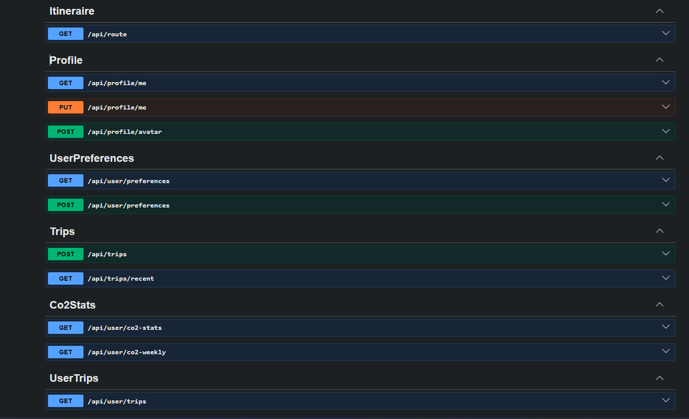
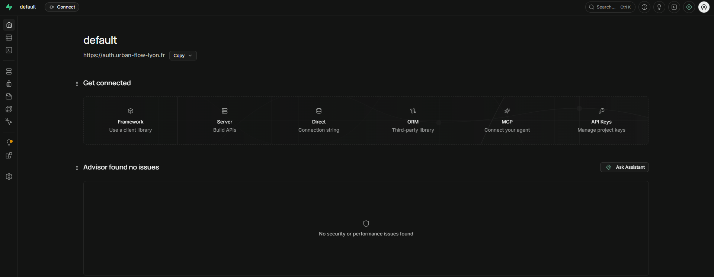
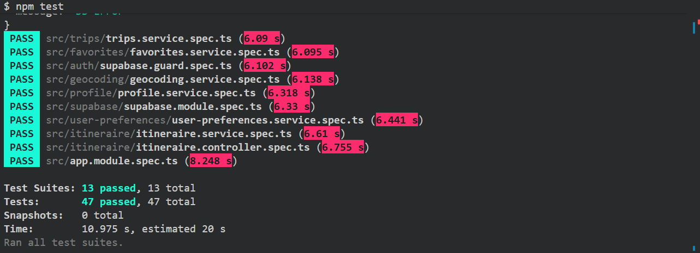
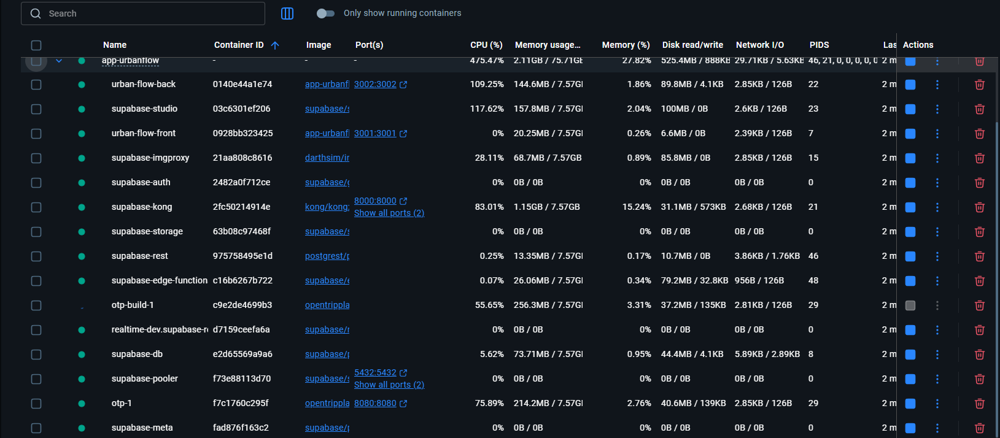
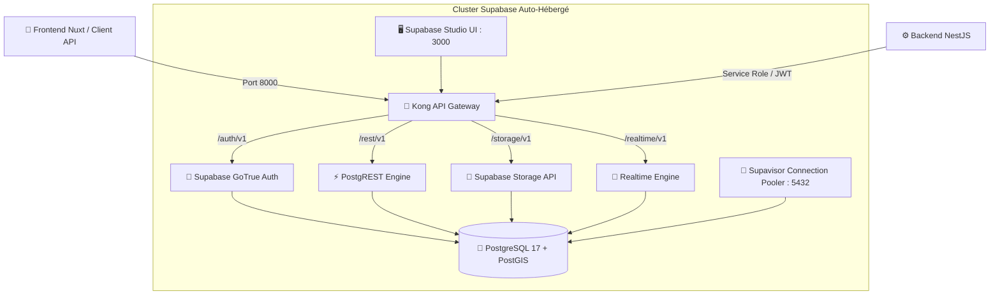
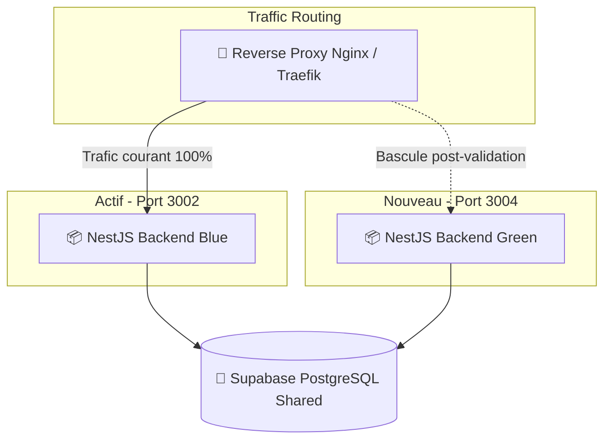

# Urban Flow — Backend (NestJS / TypeScript)

<p align="center">
  
</p>

<p align="center">
  <strong>API REST pour l'application Urban Flow.</strong>
</p>

<p align="center">
  <a href="#-architecture--stack"></a>
  <a href="#-architecture--stack"></a>
  <a href="#-infrastructure-supabase-self-hosted"></a>
  <a href="#-architecture--stack"></a>
  <a href="#-architecture--stack"></a>
  <a href="#-tests--qualité"></a>
</p>

---

## 📑 Sommaire

- [✨   Présentation & Rôle Métier](#-présentation--rôle-métier)
- [📸 Captures d'Écran & Outils d'Administration](#-captures-décran--outils-dadministration)
- [🏗️ Infrastructure Supabase Self-Hosted](#️-infrastructure-supabase-self-hosted)
- [🛠️ Stack & Modules NestJS](#️-stack--modules-nestjs)
- [🔄 Déploiement Blue / Green](#-déploiement-blue--green)
- [🔐 Sécurité & Bonnes Pratiques](#-sécurité--bonnes-pratiques)
- [📋 Documentation des Endpoints API](#-documentation-des-endpoints-api)
- [⚙️ Configuration & Variables d'Environnement](#️-configuration--variables-denvironnement)
- [💻 Installation & Démarrage](#-installation--démarrage)
- [🧪 Tests Unitaires](#-tests-unitaires)

---

## Présentation & Rôle Métier

Le backend **Urban Flow** est une API avec le framework **NestJS**. Il centralise et orchestre l'ensemble de la logique métier de la plateforme :
1. **Passerelle Multimodale** : Traduction et enrichissement des requêtes vers le moteur de routage **OpenTripPlanner 2 (OTP)**.
2. **Moteur Écologique** : Calcul scientifique des économies de CO₂ réalisées par rapport aux facteurs d'émission de l'ADEME (218 g CO₂ / km voiture).
3. **Persistance & Données Utilisateurs** : Gestion des profils, des favoris, des historiques de trajets et des préférences de déplacement via une instance **Supabase hébergée sur mesure**.
4. **Sécurité & Authentification** : Validation des sessions JWT via des Guards dédiés et sécurisation des requêtes entrantes.

---

## 📸 Captures d'Écran & Outils d'Administration


### 1. Interface Swagger UI (Documentation Interactive)




---

### 2. Dashboard Supabase Studio Self-Hosted




---

### 3. Exécution des Tests Unitaires Jest (100% Succès)




---

### 4. Vue des Conteneurs Docker en Production



---

## 🏗️ Infrastructure Supabase Self-Hosted

Contrairement aux configurations s'appuyant sur le cloud propriétaire de Supabase, **Urban Flow intègre sa propre infrastructure Supabase auto-hébergée via Docker Compose**. Cette approche garantit la souveraineté complète des données, l'absence de coûts récurrents tiers et une compatibilité RGPD totale.



### Caractéristiques de l'instance auto-hébergée :
- **PostgreSQL 17** avec extension **PostGIS** pour les calculs géographiques et spatiaux.
- **Kong API Gateway** comme point d'entrée unique sécurisé pour l'Auth, la BDD et le Storage.
- **Supabase GoTrue** pour la gestion native des sessions et des inscriptions par email / OAuth Google.
- **Row Level Security (RLS)** activé sur toutes les tables métiers pour garantir l'isolation stricte des données utilisateurs.
- **Indépendance totale** : Déployable sur n'importe quel serveur dédié ou VPS (OVHcloud, Scaleway, AWS).

---

## Stack & Modules NestJS

Le code suit les principes de la **Clean Architecture** (séparation stricte Controllers / Services / DTOs / Guards) :

```text
back-urban-flow/src/
├── auth/                 # Guards JWT Supabase, décorateurs @CurrentUser()
├── config/               # Validation stricte des variables d'environnement (Zod)
├── favorites/            # Gestion des lieux et trajets favoris (CRUD)
├── geocoding/            # Service d'autocomplétion Photon & géocodage inversé
├── itineraire/           # Intégration OpenTripPlanner 2 & calculs multimodaux
├── profile/              # Gestion des profils, avatars et niveaux éco-citoyens
├── supabase/             # Client Supabase Service Role & injection NestJS
├── trips/                # Enregistrement des trajets & calcul hebdomadaire CO2
├── user-preferences/     # Préférences de vitesse et modes de transport autorisés
├── app.module.ts         # Module racine orchestrant l'ensemble des services
└── main.ts               # Point d'entrée, Helmet, CORS, Swagger conditionnel
```

---

## Déploiement Blue / Green

Pour assurer une continuité de service 24/7 lors des montées de version de l'API sans coupure pour les utilisateurs en cours de navigation :



### Mécanisme de déploiement :
1. **Déploiement Green** : Le conteneur backend Green est instancié avec la nouvelle image Docker sur un port dédié.
2. **Warm-up & Healthchecks** : Validation de la connexion à Supabase PostgreSQL et au moteur OTP.
3. **Switch de trafic** : Mise à jour à chaud de la configuration Nginx (`nginx -s reload`) sans interruption des connexions TCP existantes.
4. **Arrêt de l'ancien conteneur** : L'environnement Blue est mis en veille une fois que toutes les requêtes en vol sont terminées.

---

## Sécurité & Bonnes Pratiques

- **Helmet & En-têtes HTTP** : Protection contre les failles XSS, clickjacking, MIME-sniffing et suppression de l'en-tête `X-Powered-By`.
- **Validation DTO stricte** : Tous les endpoints sont protégés par `class-validator` et `class-transformer` rejetant les propriétés non autorisées (`whitelist: true`).
- **Validation d'environnement (Zod)** : Échec au démarrage immédiat (`fail-fast`) si une variable obligatoire est manquante ou invalide.
- **Swagger sécurisé** : Exposition de la documentation Swagger UI réservée aux environnements de développement et automatiquement désactivée en mode `production`.
- **No-Cache sur données sensibles** : En-têtes `Cache-Control: no-store` systématiquement appliqués sur les flux utilisateurs.

---

## Documentation des Endpoints API

| Méthode | Route | Description | Protection |
| :--- | :--- | :--- | :--- |
| `GET` | `/itineraire/plan` | Calcul d'itinéraire multimodal via OTP 2 | Public / Authentifié |
| `GET` | `/geocoding/autocomplete` | Recherche d'adresses géocodées sur Lyon | Public |
| `GET` | `/api/user/profile` | Récupération du profil éco-citoyen | `Bearer JWT` |
| `PUT` | `/api/user/profile` | Mise à jour du nom et avatar | `Bearer JWT` |
| `GET` | `/api/user/preferences` | Récupération des préférences de transport | `Bearer JWT` |
| `PUT` | `/api/user/preferences` | Sauvegarde des modes et vitesse de marche | `Bearer JWT` |
| `GET` | `/api/user/trips` | Historique des trajets complétés | `Bearer JWT` |
| `POST` | `/api/user/trips` | Enregistrement d'un trajet et gain d'éco-points | `Bearer JWT` |
| `GET` | `/api/user/co2-stats` | Statistiques globales de CO₂ évité | `Bearer JWT` |
| `GET` | `/api/user/co2-weekly` | Décomposition hebdomadaire CO₂ (*réel vs voiture*) | `Bearer JWT` |
| `GET` | `/api/user/favorites` | Liste des adresses favorites de l'utilisateur | `Bearer JWT` |
| `POST` | `/api/user/favorites` | Ajout d'un nouveau favori | `Bearer JWT` |
| `DELETE` | `/api/user/favorites/:id` | Suppression d'un favori | `Bearer JWT` |

---

## ⚙️ Configuration & Variables d'Environnement

Créez un fichier `.env` à la racine de `back-urban-flow/` :

```bash
# Environnement d'exécution ('development' | 'production' | 'test')
NODE_ENV=development

# Port d'écoute du serveur
PORT=3002

# Connexion API Gateway Supabase (Kong)
SUPABASE_URL=http://localhost:8000
SUPABASE_KEY=eyJhbGciOiJIUzI1NiIsInR5cCI6IkpXVCJ9...
SUPABASE_PUBLIC_URL=http://localhost:8000

# Moteur OpenTripPlanner 2
OTP_URL=http://localhost:8080
```

---

## 💻 Installation & Démarrage

### 1. Installation des dépendances
```bash
npm install
```

### 2. Démarrage en développement (avec rechargement à chaud)
```bash
npm run start:dev
```
L'API est accessible sur [http://localhost:3002](http://localhost:3002) (Documentation Swagger sur `/api`).

### 3. Compilation et démarrage en production
```bash
npm run build
npm run start:prod
```

---

## 🧪 Tests Unitaires

Le backend intègre une suite de tests unitaires complète avec Jest garantissant la fiabilité des calculs et la sécurité des routes :

```bash
# Lancer tous les tests unitaires
npm test

# Lancer les tests en mode watch
npm run test:watch

# Générer le rapport de couverture de code
npm run test:cov
```
